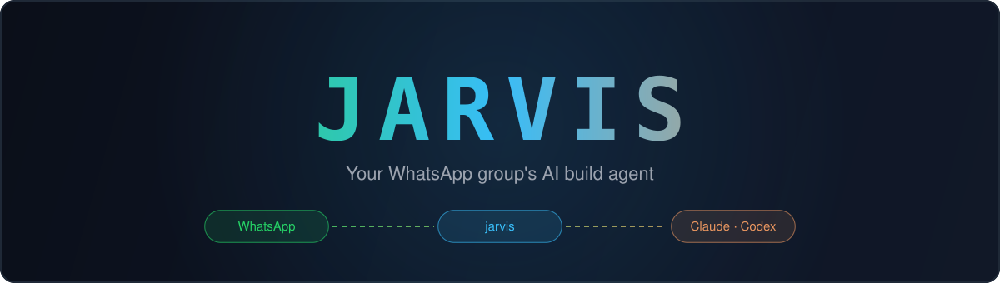

<div align="center">



### Your WhatsApp group's AI build agent

**Tag `@jarvis` in any chat. Attach a screenshot. Watch a real Claude Code or Codex
session ship code in your repo — streaming progress back like a teammate who never sleeps.**

[](LICENSE)
[](https://nodejs.org)
[](https://claude.com/claude-code)
[](https://github.com/openai/codex)
[](CONTRIBUTING.md)

</div>

---

## Demo

```text
You:        🤖 jarvis · setting up…
Terminal:

     ██╗ █████╗ ██████╗ ██╗   ██╗██╗███████╗
     ██║██╔══██╗██╔══██╗██║   ██║██║██╔════╝
     ██║███████║██████╔╝██║   ██║██║███████╗
██   ██║██╔══██║██╔══██╗╚██╗ ██╔╝██║╚════██║
╚█████╔╝██║  ██║██║  ██║ ╚████╔╝ ██║███████║
 ╚════╝ ╚═╝  ╚═╝╚═╝  ╚═╝  ╚═══╝  ╚═╝╚══════╝
  WhatsApp ⇄ Claude Code / Codex relay

  ✔ Claude Code: installed + authenticated
  ◆  Which coding agent should power it? … Claude Code
  ◆  Project directory … ~/Projects/my-app
  ◆  Approval level … approve-edits
  ✔ WhatsApp linked! Session saved.
```

```text
Teammate:  @jarvis the onboarding screen looks broken, see screenshot 📷
You:       🤖 Looking at the screenshot — the form overflows on mobile…
You:       🤖 Fixing the layout, running the component tests…
You:       🤖 ✅ Fixed. Added responsive breakpoint + regression test. 14/14 pass.
```

## ✨ Why Jarvis

| | |
|---|---|
| 🧠 **Real agents, not chatbots** | Drives actual Claude Code / Codex sessions that edit files, run tests, and verify their work |
| 🧵 **Persistent memory** | Every chat keeps one resumable session — the agent remembers the whole conversation |
| 📷 **Screenshots in** | Attach images with a message; they land in the agent's context automatically |
| 👥 **Group-native** | Anyone in the group can tag it; per-chat agent binding, whitelists, approval levels |
| 🔀 **Two engines, one config** | Claude Code ↔ Codex is a one-line switch — same interface, swappable backends |
| 🖥️ **Beautiful CLI** | Interactive setup wizard, preflight `doctor`, agent profile manager |
| 🪶 **Browserless** | Pure Node + WebSocket. No Puppeteer, no Chromium, runs on a $5 VPS |
| 💬 **Two transports** | WhatsApp (Baileys) and Slack (official Socket Mode API) — same agents, same commands |

## 🚀 Quickstart

```bash
npx jarvis-relay
```

or from a clone:

```bash
git clone https://github.com/rkd0608/jarvis-relay && cd jarvis-relay
npm install
npm run setup
```

The wizard handles everything:

1. ✔ Verifies Node 20+ and your coding-agent CLIs
2. ✔ Detects Claude Code / Codex installs + logins — walks you through either
   (rides the CLI's own auth: subscription or API key)
3. ◆ Records your agent preferences — backend, repo, approval level, persona, turn budget
4. ◆ Links WhatsApp by QR (scan once, session persists)
5. ✔ Starts the bot

Then add the bot's contact to a WhatsApp group, send `@jarvis id`, paste the id into
`jarvis.config.json → groups`, restart. Done.

### 💬 Connecting Slack (optional)

```bash
jarvis slack
```

The wizard saves a ready-made app manifest (`slack-app-manifest.yml`), then asks for two
tokens from [api.slack.com/apps](https://api.slack.com/apps):

1. **Create New App → From an app manifest** → paste the manifest → create
2. **Install to Workspace** → copy the Bot Token (`xoxb-…`)
3. **Socket Mode** → create an app-level token (`xapp-…`)
4. Paste both into the wizard — it validates them live
5. `/invite @jarvis` in a channel, send `@jarvis id`, register the id like above

Each Slack **thread** gets its own resumable agent session — parallel conversations in
one channel.

## 💬 Usage

| Message | Effect |
|---|---|
| `@jarvis fix the login bug` | Sends work to the chat's agent |
| `@jarvis <request>` + 📷 | Screenshot lands in `inbox/`, agent sees it |
| `!jarvis <request>` | Prefix trigger (same as mention) |
| `@jarvis status` | Active agent, backend, current session |
| `@jarvis id` | This chat's id — paste into `groups` in config |
| `@jarvis new` | Fresh session (wipes conversation memory) |
| `@jarvis use <profile>` | Bind this chat to another agent profile |
| `@jarvis use <session-id>` | Attach to a specific past session |
| `@jarvis sessions` | List recent sessions for the project |

### 🧵 Sessions

The first request creates a new agent session; every later message **resumes the same
session** — the agent remembers the entire conversation. Session ids live in
`jarvis.state.json`. To continue a session you ran manually in your terminal, grab the
UUID (`~/.claude/projects/<slugified-repo>/` for Claude, `~/.codex/sessions/` for Codex)
and send `@jarvis use <uuid>`.

## 🖥️ CLI

```
jarvis              start the bot (auto-runs setup if unconfigured)
jarvis setup        interactive onboarding wizard
jarvis doctor       preflight: node, backends, auth, whatsapp session
jarvis agent list   show agent profiles
jarvis agent add    add an agent profile
jarvis agent remove remove an agent profile
```

<details>
<summary><b>⚙️ Configuration reference</b></summary>

`jarvis.config.json` (created by the wizard, see
[`jarvis.config.example.json`](jarvis.config.example.json)):

| Key (per agent) | Values | Notes |
|---|---|---|
| `backend` | `claude-code` \| `codex` | Which engine does the work |
| `projectDir` | absolute path | Repo the agent works in |
| `approval` | `read-only` \| `approve-edits` \| `full-auto` | Translated per engine below |
| `groups` | array of chat ids | Chats this agent answers in |
| `allowedUsers` | array of ids or `["*"]` | Who may trigger it. Default: everyone |
| `sessionId` | uuid or null | Session to attach at startup |
| `systemPrompt` | string | The agent's persona |
| `allowedTools` | array | Claude Code tool allowlist (omit for all) |
| `maxTurns` | number | Agent turn budget per request (default 40) |

Approval mapping:

| `approval` | Claude Code | Codex |
|---|---|---|
| `read-only` | plan mode | `--sandbox read-only` |
| `approve-edits` | acceptEdits | `--full-auto` |
| `full-auto` | bypassPermissions ⚠️ | bypass approvals+sandbox ⚠️ |

| `openGroups` (answer in any group it's added to), `selfTrigger`
(`Jarvis, …` from the bot account itself), `inboxDir`, and a `slack` block
(`botToken`, `appToken`, `botUserId` — created by `jarvis slack`).

</details>

<details>
<summary><b>🔋 Running 24/7</b></summary>

```bash
npm i -g pm2
pm2 start src/index.js --name jarvis && pm2 save
pm2 startup   # follow the printed sudo instruction — auto-start on boot
```

The bot is a plain Node + WebSocket client (no browser), so it also runs happily on a
cheap VPS — copy the folder, `npm i && npm run setup`, scan once. Your phone only needs
to come online once every 14 days to keep the linked device alive.

</details>

## 🏗️ How it works

```text
src/
├── index.js            runBot() entry point
├── whatsapp.js         Baileys adapter (QR link, message normalization, media)
├── router.js           triggers, whitelist, media inbox, job queue, replies
├── commands.js         @jarvis status/new/use/sessions
├── auth.js             whitelist + trigger parsing (LID-aware)
├── config.js           config loader + validation
├── state.js            per-chat agent/session state
├── queue.js            serializes agent jobs
├── cli/                setup wizard, doctor, agent manager, UI primitives
└── backends/
    ├── index.js        dispatcher (backend field → adapter)
    ├── claude.js       @anthropic-ai/claude-agent-sdk (session resume)
    ├── codex.js        codex exec CLI
    └── shared.js       prompt building + message splitting
```

Adding another engine = one file exporting
`run(agent, prompt, images, onProgress) → { summary, sessionId }` plus a line in
`backends/index.js`.

> [!WARNING]
> **Security** — triggering Jarvis means running an agent with shell access on your
> machine. Keep `allowedUsers` strict in groups you don't fully trust, prefer
> `approve-edits` over `full-auto`, and remember that unknown chats are ignored until
> you register their id. Baileys is an unofficial WhatsApp client: fine for personal
> use, with a small (rare) ban risk on a personal number.

<details>
<summary><b>🩺 Troubleshooting</b></summary>

- **No reply at all** → `jarvis doctor`; check the chat id is registered (`@jarvis id`)
- **"Not logged in"** → run `claude` / `codex login` in a terminal, then re-test
- **"Usage limit reached"** → your plan's limit; wait for the reset shown in the error
- **WhatsApp disconnected** → the bot auto-reconnects; if logged out, delete
  `session-baileys/` and re-scan
- **Bot sends but never reacts** → ensure the phone came online in the last 14 days
  (WhatsApp logs out linked devices after two weeks of silence)

</details>

## 🤝 Contributing

PRs welcome — new backends, better group permission flows, media types, tests. Keep
PRs focused; open an issue first for bigger changes.

<div align="center">

**[MIT License](LICENSE)**

</div>
